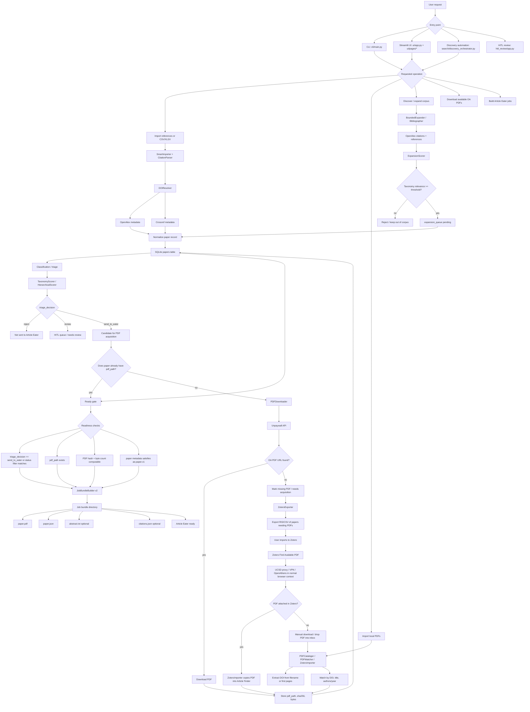

# Article Finder to Article Eater Pipeline

This diagram traces the current Article Finder flow from the first user request to PDF acquisition and Article Eater job readiness.



## Operational Sequence

1. User starts from CLI, UI, or `discover`.
2. Article Finder imports or discovers candidate papers.
3. DOI metadata is resolved through OpenAlex and Crossref, then stored in `papers`.
4. Papers are classified against the taxonomy and assigned a triage decision.
5. Papers with `triage_decision = send_to_eater` need a valid local `pdf_path`.
6. Open-access PDFs are downloaded through Unpaywall.
7. Paywalled PDFs are routed through Zotero/UCSD or local inbox/manual import.
8. Once `pdf_path`, hash, byte count, and metadata are present, `JobBundleBuilder` creates the Article Eater bundle.

## Current PDF Acquisition Design

Article Finder intentionally uses legal and stable acquisition layers:

- `PDFDownloader`: Unpaywall open-access PDF lookup and download.
- `ZoteroExporter`: exports missing PDFs to RIS/CSV for Zotero.
- `ZoteroImporter`: imports Zotero-attached PDFs back into Article Finder.
- `PDFCataloger` / `PDFWatcher`: imports manually collected PDFs from folders.

This is the right design for UCSD access because Zotero and the user's normal browser session handle institutional authentication better than automated browser scraping.

## Ready For Article Eater

A paper is effectively ready when:

- It is selected by status/triage, usually `send_to_eater`.
- It has `pdf_path`.
- The PDF exists on disk.
- `pdf_sha256` and `pdf_bytes` can be computed.
- Required `ae.paper.v1` metadata is present: `paper_id`, `title`, `authors`, `year`, `source`, and `files`.

The bundle output is:

```text
job_<paper_id>_<timestamp>/
  paper.pdf
  paper.json
  abstract.txt       optional
  citations.json     optional
```

## Gaps To Watch

- `eater_interface/pipeline.py::acquire_pdfs` is still a stub, while the actual acquisition implementation lives in `ingest/pdf_downloader.py`.
- `search/discovery_orchestrator.py::_run_acquisition_phase` expects `attempted` and `not_available`, but `PDFDownloader.download_all()` currently returns `total` and `failed`.
- Paywalled PDFs should flow through Zotero/manual inbox rather than automated publisher-browser login.
