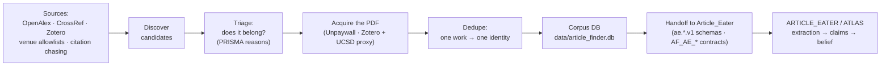

# Article Finder: A Human Guide

*The part of the system that decides which papers get read at all — and tries to make that a
defensible choice rather than an accident of what was easy to reach.*

**For a person, not an agent.** Plain-language introduction; no background in the codebase, in
information retrieval, or in the wider evidence pipeline assumed (second-year-undergraduate level). To
change code, read [`REPO_STATE_MODEL_AND_PLAN.md`](REPO_STATE_MODEL_AND_PLAN.md) and
[`../GOVERNANCE_REPORT.md`](../GOVERNANCE_REPORT.md) — they answer *what will I break*. This guide
answers the prior question: *what is this for, and why is it built the way it is.*
**Provenance convention:** **[verified]** = read out of this repository this session; **[stated — DK]**
= David Kirsh's stated intent, recorded as direction; **[open]** = named but not built yet.

- `STATE_AS_OF: 2026-08-14`
- `JUDGED_REVIEWED: 2026-08-14`
- `STALE_AFTER_DAYS: 30`

> **Where this sits in the whole system.** Article Finder is the **front door that feeds the evidence
> engine** — one organ of the larger enterprise described in [`../../atlas_shared/docs/SYSTEM_OVERVIEW.md`](../../atlas_shared/docs/SYSTEM_OVERVIEW.md)
> ("The Fourth Code"). Its job is the disciplined discovery and acquisition of the articles that
> Article_Eater then reads and turns into graded, defeasible belief. Everything downstream — the claim
> extraction, the web of belief, the Bayesian network, the payload students eventually read — operates
> on a corpus that this repository assembled, so a bias or a gap or a duplicate introduced here cannot
> be repaired by any amount of cleverness further along.

---

## 1 · The idea, in one paragraph

Before you can ask how much to believe a body of research, you have to have gathered it, and gathering
it honestly is harder than it first appears. The obvious approach — type some keywords into a search
engine, take the top results, and download whatever PDF is free — quietly builds a corpus that is
biased toward whatever the search engine ranks well and toward whatever happens to be openly
accessible, which is not at all the same thing as the papers that actually bear on the question. Article
Finder is the tool that tries to do this part properly for one specific literature, the science of how
the built environment shapes the mind. It finds candidate papers across several sources, decides which
ones genuinely belong in the corpus and records *why* each excluded one was excluded, acquires the
PDFs — including the paywalled ones, through a two-way bridge to the researcher's own Zotero library and
the university's library proxy — makes sure that one real work ends up as exactly one record rather than
three near-duplicates, and then hands the result across a governed boundary to Article_Eater, the engine
that reads it. The organising commitment, stated in the repository's own words, is that a larger corpus
is not a better one **[verified · `docs/REPO_STATE_MODEL_AND_PLAN.md` §3]**; what makes a corpus good is
that you can say why each paper is in it, why each candidate was left out, and that no work appears twice
wearing two different identities.

## 2 · Why this is research and not just a search wrapper

It is tempting to see this as plumbing — a script that calls some APIs and copies some files — and the
temptation is worth resisting, because the choices that look like plumbing are exactly the ones that
decide whether the downstream science is trustworthy. Consider the single feature the repository calls
its key innovation, *bounded expansion* **[verified · `README.md`]**. One good way to find more relevant
papers is to follow citations: take the papers you already trust, and look at what they cite and what
cites them. The trouble is that citation chains do not respect topic boundaries, so if you simply follow
every link you drift, within a hop or two, out of neuroarchitecture and into general neuroscience or
general psychology, and the corpus fills up with material that is real and well-cited and beside the
point. So instead of taking every citation, the system scores each discovered paper against a structured
picture of what this field is actually about, and admits only the ones that score above a threshold
(0.35 by default, followed to a citation depth of two) **[verified · `search/bounded_expander.py`,
`search/expansion_scorer.py`]**. Whether that threshold is set correctly, and whether the picture of the
field it scores against is the right one, are research questions with real consequences, not settings you
can tune by feel. The same is true of deduplication, where the hard part is not catching obvious repeats
but drawing the line between two records of one work, which must be merged, and two genuinely different
works that happen to resemble each other, which must never be — a distinction the whole downstream system
depends on, because every identifier further along assumes that one identity means one work
**[verified · `docs/REPO_STATE_MODEL_AND_PLAN.md` §3]**. And it is true of the exclusion log, which
follows the PRISMA discipline of recording a reason for every paper kept out, so that the boundary of the
corpus is something you can argue about rather than merely a number you have to trust.

## 3 · How the approach works (the pipeline)

A paper travels through five stages, and the design treats the boundary at the far end — the handoff to
Article_Eater — as the part most deserving of care, because a duplicate or a misclassification that
crosses that line corrupts an identity that everything downstream is built on **[verified]**.

The five stages are **find** candidates (from OpenAlex and CrossRef queries, from a curated list of
allowed journals, and from bounded citation chasing), **triage** them against the taxonomy so that only
in-domain work enters and every exclusion carries a recorded reason, **acquire** the actual PDFs
(open-access ones through the Unpaywall service, paywalled ones through the two-way Zotero bridge that
uses the university library's proxy), **dedupe** so that one work becomes one record, and **hand off** the
result to Article_Eater under a set of signed contracts. The structured picture the triage stage scores
against is a nine-facet taxonomy of the field **[verified · `config/taxonomy.yaml`]** — the environmental
factors that act as causes, the outcomes they are supposed to affect, the subjects studied, the settings,
the methodology, whether the study was of a real or a virtual space, cross-modal effects, the theory
invoked, and the strength of the evidence — and papers are matched to it by turning their titles and
abstracts into numerical vectors and comparing them to a stored profile of each facet. That the handoff
is contract-governed at all is unusual for an acquisition tool, and it is deliberate: the repository
carries Article_Eater's own data schemas so that both sides check against one shared definition rather
than two copies that slowly drift apart **[verified · `schemas/ae.*.v1.schema.json`]**.

## 4 · What exists today — and the honest boundary

Most of what this guide describes is genuinely built and running, and the honest reservations are about
*wiring* and *exercise* rather than about vaporware. The find-triage-acquire-dedupe pipeline is real code
that works end to end, driven from a single command-line program **[verified · `cli/main.py`,
`search/discovery_orchestrator.py`]**. The external sources are real HTTP clients, not stubs: OpenAlex
for search and citation graphs, CrossRef for resolving identifiers, and Unpaywall for open-access PDFs
**[verified · `ingest/doi_resolver.py`, `ingest/pdf_downloader.py`]**; the two-way Zotero bridge that
reaches paywalled papers through the UCSD library is also real **[verified · `ingest/zotero_bridge.py`]**.
Semantic Scholar is configured but its code path is comparatively thin, and there are no clients for
PubMed or arXiv at all **[verified]** — so the reach of the "find" stage is narrower than a reader might
assume from the phrase "across sources." The corpus itself is substantial: the live database holds
roughly 16,300 papers **[verified · `data/article_finder.db`, queried this session]**, and there are
about 638 acquired PDFs on disk **[verified · `docs/REPO_STATE_MODEL_AND_PLAN.md` §4]**. The test suite
leans, sensibly, toward the contracts and the data-integrity machinery rather than toward the acquisition
APIs — twenty-one test files with roughly ninety test functions **[verified · `tests/`]**.

The honest boundary has three parts, and the first is the one that matters most. **The disciplined,
contract-governed handoff to Article_Eater exists in code, but it is not the path the two systems
actually use.** The repository holds the contracts, the shared schemas, and a real handoff
implementation that will bundle papers and even shell out to run Article_Eater on them
**[verified · `eater_interface/`, `contracts/AF_AE_*`]** — and yet, by the state model's own candid
account, Article_Eater reads this repository *directly*, with its absolute path hardcoded in at least
eight of Article_Eater's own scripts, consuming the corpus database and the PDF folder without passing
through the contract at all: *"The contracted path is real; the traffic is on the uncontracted one"*
**[verified · `docs/REPO_STATE_MODEL_AND_PLAN.md` §1]**. Consistent with this, the current database shows
no claims and no rules flowing back from Article_Eater into it **[verified — claims and rules tables both
empty this session]**, and almost every one of its 16,300 papers is still marked as a candidate rather
than as something sent onward. So the coupling to the evidence engine is genuine and load-bearing, but it
runs on a back channel, and the front channel — the governed one this guide has been describing — is
built and largely unexercised. The second part follows from that: the handoff contracts have, as far as
the record shows, never actually rejected a deliberately bad handoff, and a contract that has never
rejected anything is not yet known to be a gate **[verified · §6-C of the state model]**. The third part
is smaller and more ordinary — the "AE waiting-room" duplicate check that is supposed to ask
Article_Eater whether it already has a paper before storing it is implemented but best-effort, and simply
proceeds if Article_Eater's own probe script is missing **[verified · `ingest/ae_waiting_room_probe.py`]**;
the knowledge-synthesis layer is written but has no data flowing through it in this database
**[verified]**; and an intended LLM-based claim verifier is still a keyword-only placeholder
**[verified · `TODO.md`]**. None of this is hidden — the repository documents it about itself, which is
part of why it can be trusted to say what it has not yet done.

## 5 · Where we're going

The near-term direction, as recorded in the state model's own plan, is less about adding features than
about proving that the disciplined machinery already built actually holds under pressure **[verified ·
`docs/REPO_STATE_MODEL_AND_PLAN.md` §6]**. The most consequential item is to make the AF→AE handoff
contract earn its name by showing it reject a deliberately malformed handoff, so that it becomes a gate
rather than a hope, and — the larger structural question underneath it — to decide whether the real,
uncontracted back channel between the two repositories should be brought under the contract or the
contract retired as aspirational. Alongside that sit a cluster of housekeeping problems that are real
because they touch meaning rather than tidiness: the vocabulary of outcome terms is currently defined in
three separate places, so that the same outcome word can mean subtly different things depending on which
code path produced it, and the declared canonical authority for those terms lives in a sibling repository,
`Outcome_Contractor`, which also — awkwardly — contains a second, independent implementation of this
repository's whole job that has to be reconciled by comparing behaviour rather than by diffing files. And
running through all of it is the discipline the plan keeps returning to, that the number worth reporting
is never "papers acquired" on its own but "acquired out of eligible, with the failure modes of the
remainder," because that ratio, and not the raw count, is what tells you whether the corpus has quietly
tilted toward whatever was easy to reach **[verified · §6-E]**.

## 6 · Milestones for the next phase

In rough order, and drawn from the repository's own plan rather than invented here **[verified ·
`docs/REPO_STATE_MODEL_AND_PLAN.md` §6]**:

1. **Prove the handoff contract can fail.** Feed the AF→AE dedupe and handoff contracts a deliberately
   bad payload and show them refusing it. *Exit: the contract is demonstrably a gate, not decoration.*
2. **Settle the two doors to Article_Eater.** Decide whether the real, uncontracted path (AE reading
   this repo's database and PDFs directly) is brought under the contract or the contract is retired.
   *Exit: one governed path, or an honest statement that there is not one.*
3. **Resolve the outcome-vocabulary triplication.** Reconcile the three definition sites, or declare two
   of them derived from the canonical `Outcome_Contractor`. *Exit: one outcome term means one thing.*
4. **Resolve the two article-finding implementations.** Compare this repository's pipeline against the
   independent one in `Outcome_Contractor/article_finder/` by behaviour, and — under the no-delete-without-
   proof rule — retire nothing without containment proof. *Exit: one pipeline, or a clear division of labour.*
5. **Report acquisition with its denominator.** Publish acquisition as a rate against eligible papers,
   with the failure modes of the ones not acquired. *Exit: corpus bias is measurable, not assumed.*
6. **Clean up the traps that mislead a newcomer.** The empty zero-byte `articles.db` at the root that
   shadows the real 516 MB corpus database, the repository's disagreement with itself about its own
   version number (3.2.3 versus 3.2.4), and the checked-in rejected-patch artifact. *Exit: the obvious
   reading of the repository is the correct one.*

Two of these — the LLM claim verifier and the knowledge-synthesis layer that currently has no data — are
best thought of as **[open]**: coded or partly coded, but waiting on the handoff loop actually carrying
traffic before they have anything to work on.

## 7 · Glossary — the terms that gate the reading

| Term | Meaning here |
|---|---|
| **corpus** | the assembled, deduplicated set of papers the whole downstream system reasons over |
| **bounded expansion** | following citations to find more papers, but admitting only those that score in-domain against the taxonomy |
| **taxonomy (9 facets)** | the structured picture of the field: environmental factors · outcomes · subjects · settings · methodology · modality · cross-modal · theory · evidence strength |
| **triage** | the decision about whether a candidate belongs in the corpus, with a recorded reason if not |
| **PRISMA accounting** | the discipline of recording *why* each excluded paper was excluded, so the corpus boundary is arguable |
| **dedupe** | ensuring one real work becomes exactly one record; the hard case is telling near-duplicates from genuinely distinct works |
| **handoff** | crossing the governed boundary to Article_Eater, validated against shared `ae.*` schemas |
| **the two doors** | the contracted handoff (built, thin traffic) versus AE reading this repo's DB and PDFs directly (uncontracted, where the real traffic is) |
| **waiting-room gate** | asking Article_Eater whether it already holds a paper before storing it; best-effort, skipped if AE's probe is absent |
| **Zotero bridge** | the two-way link to the researcher's Zotero library used to acquire paywalled PDFs via the UCSD library proxy |
| **the corpus DB** | `data/article_finder.db` (~516 MB) — *not* the 0-byte `articles.db` at the repo root |

## 8 · Further reading

- [`REPO_STATE_MODEL_AND_PLAN.md`](REPO_STATE_MODEL_AND_PLAN.md) — "the document a new AI reads first";
  the authoritative, unusually candid state-and-plan map, including the two-doors coupling and the
  size-and-name traps. Read before changing code.
- [`../README.md`](../README.md) — the version story, the CLI commands, and the Zotero bridge.
- [`../contracts/AF_AE_HANDOFF_AUTHORITY_2026-05-10.md`](../contracts/AF_AE_HANDOFF_AUTHORITY_2026-05-10.md)
  — read before touching anything that crosses to Article_Eater.
- [`USER_GUIDE.md`](USER_GUIDE.md) and [`ZOTERO_UCSD_SETUP.md`](ZOTERO_UCSD_SETUP.md) — how to actually run it.
- [`../../atlas_shared/docs/SYSTEM_OVERVIEW.md`](../../atlas_shared/docs/SYSTEM_OVERVIEW.md) — "The Fourth Code": how this front door fits with
  the evidence engine, the space-reader, and the experiment side as one system.

## Provenance

The destination (a defensible neuroarchitecture corpus feeding Article_Eater under governed contracts;
one work → one identity; acquisition reported with its denominator) is drawn from this repository's own
`docs/REPO_STATE_MODEL_AND_PLAN.md` and `README.md`, and where it reflects David Kirsh's stated intent it
is marked **[stated — DK]** and kept distinct from what is built. Present-state facts — the five-stage
pipeline, the nine-facet taxonomy, bounded expansion with its 0.35 threshold and depth 2, the OpenAlex /
CrossRef / Unpaywall / Zotero clients, the absence of PubMed and arXiv clients, the ~16,300-paper corpus
with empty claims and rules tables, the ~638 PDFs, the twenty-one test files, the contracted-versus-
uncontracted handoff, the never-yet-exercised handoff contract, and the version disagreement — are
**[verified]** from the repository's source, config, database, and state model, all read this session.
The state model itself flags (its §9) that this human introduction was *owed and did not yet exist*; this
file discharges that. Items marked **[open]** are named intentions or coded-but-unexercised components,
not working features. Second-year-undergraduate framing per the fleet living-doc convention.
